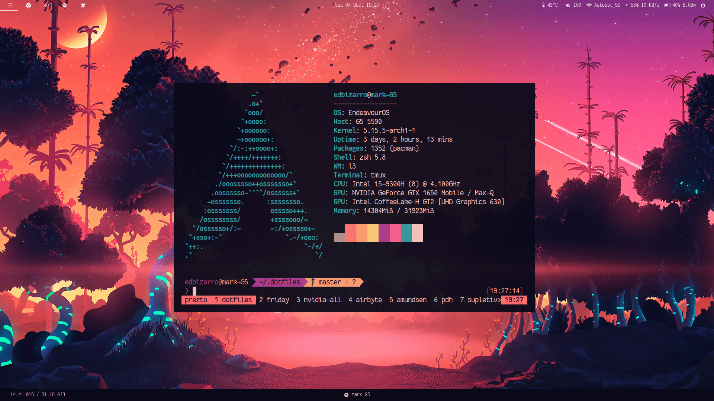
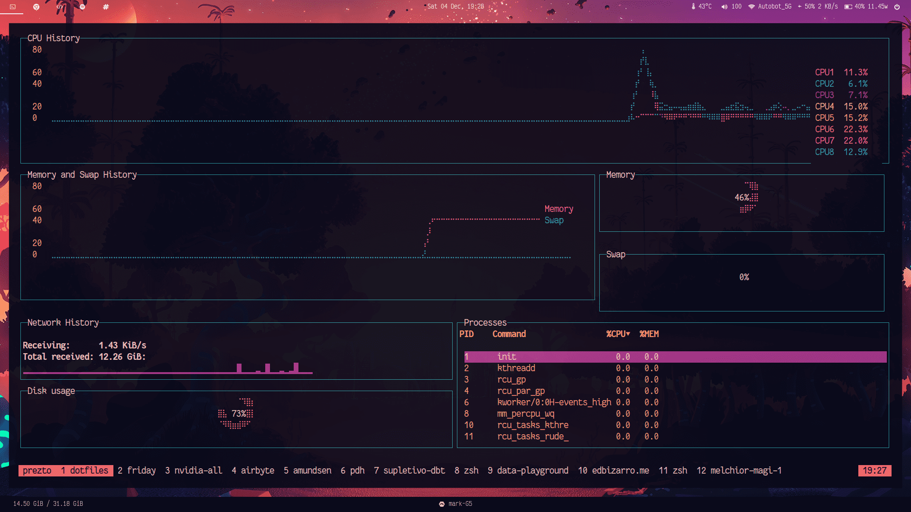

# dotfiles

A collection of my personal dotfiles. Here's a little preview of what it can look like:

## Current desktop

### Previous themes

Previous themes can be found on [reddit](https://www.reddit.com/r/unixporn/search?q=author:edbizarro&sort=new&restrict_sr=on&t=all) and [releases](https://github.com/edbizarro/dotfiles/releases) page

### Requirements

* [dunst](https://github.com/dunst-project/dunst)
* [i3-gaps](https://github.com/Airblader/i3)
* [NerdFonts](https://github.com/ryanoasis/nerd-fonts) (font polybar icons)
* [picom](https://github.com/yshui/picom)
* [polybar](https://github.com/jaagr/polybar)
* [prezto-contrib](https://github.com/belak/prezto-contrib)
* [prezto](https://github.com/sorin-ionescu/prezto) (for zsh)
* [rxvt-unicode](https://wiki.archlinux.org/index.php/rxvt-unicode)
* [tamzen](https://github.com/sunaku/tamzen-font) (font for polybar text)
* [tmux](https://github.com/tmux/tmux) + [tpm](https://github.com/tmux-plugins/tpm)
* [Undefined Medium Fonts](https://github.com/andirueckel/undefined-medium)
* [zsh](http://www.zsh.org)

### Optional

* [betterlockscreen](https://github.com/pavanjadhaw/betterlockscreen) (fancy lockscreen)
* [cava](https://github.com/karlstav/cava)
* [feh](https://feh.finalrewind.org) (change wallpaper)
* [mons](https://github.com/Ventto/mons)
* [mopidy](https://www.mopidy.com/)
* [ncmpcpp](http://rybczak.net/ncmpcpp/) + [lyvi](http://ok100.github.io/lyvi/) for lyrics + [bum](https://github.com/dylanaraps/bum) (album artwork)
* [prezto-wakatime](https://github.com/philihp/wakatime-zprezto)
* [pywal](https://github.com/dylanaraps/pywal) (generate colourschemes based on wallpaper)

#### Cool fonts

* [icomoon](https://icomoon.io)
* [Input Font](http://input.fontbureau.com/download/)
* [Pragmata](https://github.com/fabrizioschiavi/pragmatapro)
* Bitmap fonts
   * [bitmap fonts](https://github.com/Tecate/bitmap-fonts) (A collection of monospaced bitmap fonts)
   * [cherry](https://github.com/MarinHoc/cherry-font)
   * [proggyfonts](https://proggyfonts.net/download/) (Monospaced Bitmap Fonts)
   * [scientifica](https://github.com/NerdyPepper/scientifica)
   * [siji-font](https://github.com/stark/siji)
   * [tamsyn](http://www.fial.com/~scott/tamsyn-font/)
   * [tewi-font](https://github.com/lucy/tewi-font)

## Installation

Clone this repository:

    git clone https://github.com/edbizarro/dotfiles.git ~/.dotfiles

### Using [GNU Stow](https://www.gnu.org/software/stow/) _(recommended)_

Install GNU Stow _(if not already installed)_

    Mac:      brew install stow
    Ubuntu:   apt-get install stow
    Fedora:   yum install stow
    Arch:     pacman -S stow

Then simply use stow to install the dotfiles you want to use Ex:

    stow xresources

Or to install all my dotfiles config:

    cd ~/.dotfiles && \
      stow i3 && \
      stow mopidy && \
      stow cava && \
      stow ncmpcpp && \
      stow neofetch && \
      stow stow && \
      stow wal && \
      stow git && \
      stow ssh && \
      stow tmux && \
      stow picom && \
      stow dunst && \
      stow xresources && \
      cd ~/.dotfiles/zsh && \
      stow configs -t ~/

We may get some warning messages like the following one:

    cd ~/Dotfiles
    stow git
    WARNING! stowing git would cause conflicts:
      * existing target is neither a link nor a directory: .gitconfig
    All operations aborted.

Or

    WARNING! stowing git would cause conflicts:
      * existing target is not owned by stow: .gitconfig
    All operations aborted.

This means that the file `.gitconfig` (or any other file name that appear in the warning) exists before the symlinking. We need to
manually change its name so GNU Stow can create the symlink. My recommendation is
to rename it:

    mv ~/.gitconfig ~/.gitconfig.old
