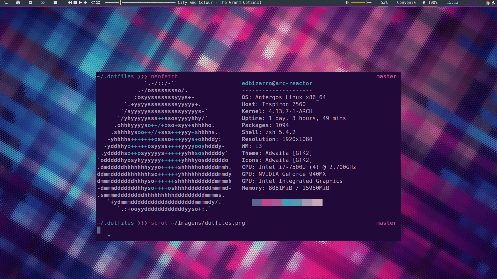
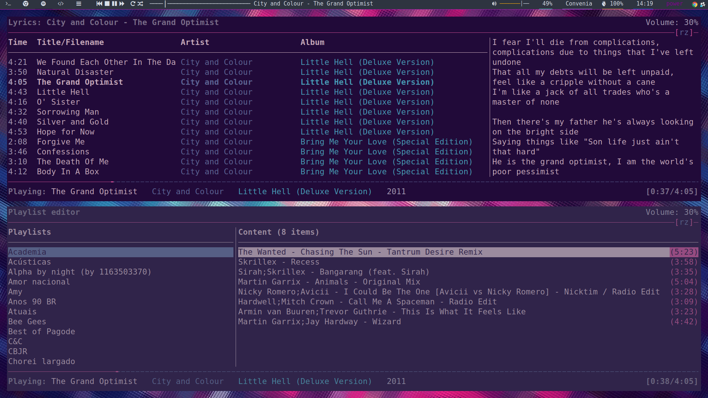

dotfiles
========

A collection of my personal dotfiles. Here's a little preview of what it can look like:

ncmpcpp

Installation
------------

#### Requirements

* zsh
* [prezto](https://github.com/sorin-ionescu/prezto) (for zsh)
* [tpm](https://github.com/tmux-plugins/tpm) (for tmux)
* [i3gaps](https://github.com/Airblader/i3)
* [polybar](https://github.com/jaagr/polybar)

Clone this repository:

    git clone https://github.com/edbizarro/dotfiles.git ~/.dotfiles

### Using [GNU Stow](https://www.gnu.org/software/stow/) _(recommended)_
Install GNU Stow _(if not already installed)_

    Mac:      brew install stow
    Ubuntu:   apt-get install stow
    Fedora:   yum install stow
    Arch:     pacman -S stow

Then simply use stow to install the dotfiles you want to use:

    cd ~/.dotfiles && \
      stow mopidy && \
      stow ncmpcpp && \
      stow git && \
      stow ssh && \
      cd ~/.dotfiles/zsh && \
      stow config -t ~/
