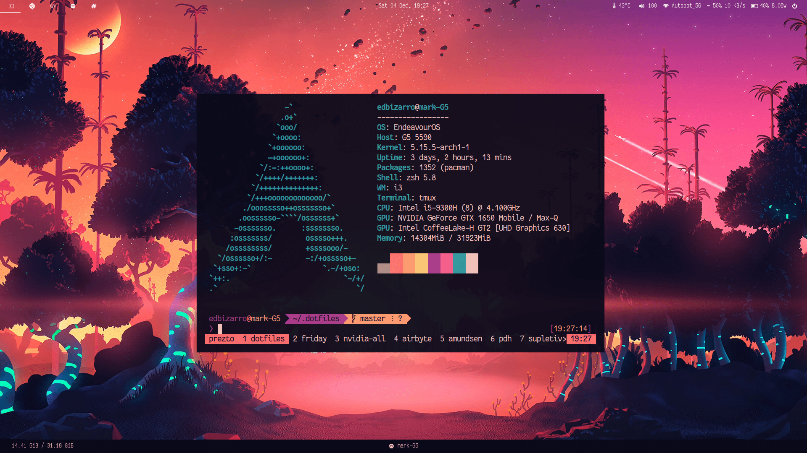
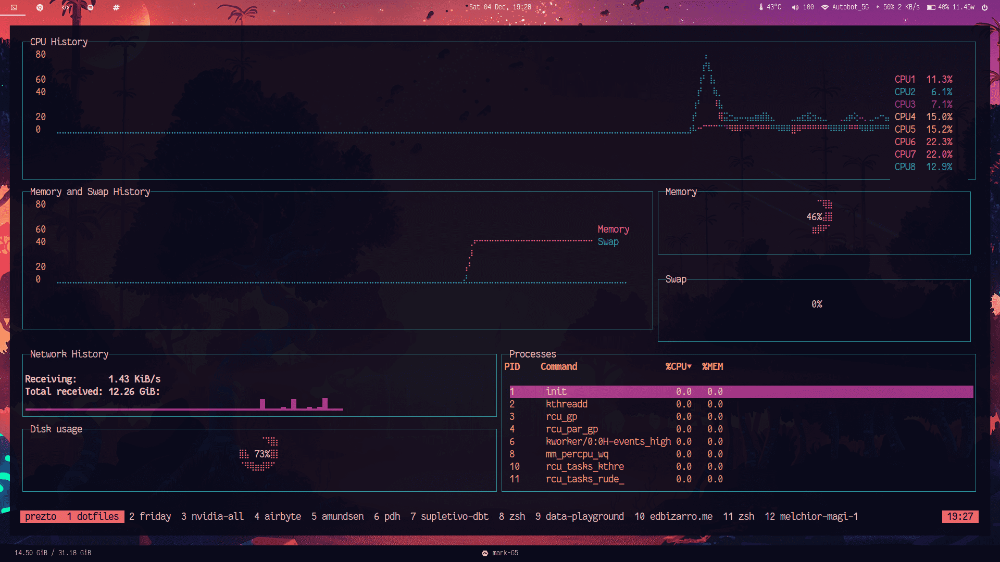

# dotfiles

A collection of my personal dotfiles for **Arch Linux** and **Ubuntu 24.04**, managed with [GNU Stow](https://www.gnu.org/software/stow/).

## Current desktop

### Previous themes

Previous themes can be found on [reddit](https://www.reddit.com/r/unixporn/search?q=author:edbizarro&sort=new&restrict_sr=on&t=all) and [releases](https://github.com/edbizarro/dotfiles/releases) page

## Requirements

* [dunst](https://github.com/dunst-project/dunst)
* [i3](https://i3wm.org/) (with gaps support)
* [NerdFonts](https://github.com/ryanoasis/nerd-fonts) (polybar icons)
* [picom](https://github.com/yshui/picom)
* [polybar](https://github.com/polybar/polybar)
* [prezto-contrib](https://github.com/belak/prezto-contrib)
* [prezto](https://github.com/sorin-ionescu/prezto) (zsh framework)
* [tamzen](https://github.com/sunaku/tamzen-font) (polybar text font)
* [tmux](https://github.com/tmux/tmux) + [tpm](https://github.com/tmux-plugins/tpm)
* [zsh](http://www.zsh.org)

### CLI tools

* [eza](https://github.com/eza-community/eza) or exa (ls replacement)
* [fd](https://github.com/sharkdp/fd) (find replacement)
* [ripgrep](https://github.com/BurntSushi/ripgrep) (grep replacement)
* [tldr](https://github.com/tldr-pages/tldr) (man replacement)
* [delta](https://github.com/dandavison/delta) (git diff pager)
* [atuin](https://github.com/atuinsh/atuin) (shell history)
* [uv](https://github.com/astral-sh/uv) (Python package/env manager)

### Optional

* [betterlockscreen](https://github.com/pavanjadhaw/betterlockscreen) (fancy lockscreen)
* [cava](https://github.com/karlstav/cava)
* [feh](https://feh.finalrewind.org) (change wallpaper)
* [mons](https://github.com/Ventto/mons)
* [mopidy](https://www.mopidy.com/)
* [ncmpcpp](http://rybczak.net/ncmpcpp/)
* [pywal](https://github.com/dylanaraps/pywal) (generate colourschemes based on wallpaper)

## Installation

Clone this repository:

    git clone https://github.com/edbizarro/dotfiles.git ~/.dotfiles

### Using GNU Stow _(recommended)_

Install GNU Stow:

    Arch:     pacman -S stow
    Ubuntu:   sudo apt install stow

Use stow to install the dotfiles you want:

    cd ~/.dotfiles && stow --target=$HOME <package>

Or to install all configs:

    cd ~/.dotfiles && \
      stow --target=$HOME i3 && \
      stow --target=$HOME mopidy && \
      stow --target=$HOME cava && \
      stow --target=$HOME ncmpcpp && \
      stow --target=$HOME wal && \
      stow --target=$HOME git && \
      stow --target=$HOME ssh && \
      stow --target=$HOME tmux && \
      stow --target=$HOME picom && \
      stow --target=$HOME dunst && \
      stow --target=$HOME xresources && \
      stow --target=$HOME atuin && \
      stow --target=$HOME nvim && \
      stow --target=$HOME borgmatic && \
      stow --target=$HOME pipewire && \
      cd ~/.dotfiles/zsh && stow configs -t ~/

### Handling conflicts

If stow warns about existing files, rename them first:

    mv ~/.gitconfig ~/.gitconfig.old
    cd ~/.dotfiles && stow --target=$HOME git

## Multi-distro support

These dotfiles work on both **Arch Linux** and **Ubuntu 24.04**.

### How it works

* **Distro detection**: `zsh/exports/00-distro.zsh` sets `$DISTRO_ID` (`arch` or `ubuntu`) via `/etc/os-release`
* **Conditional aliases**: `arch.zsh` and `ubuntu.zsh` load distro-specific commands (e.g., `update-shit` uses `pacman` on Arch, `apt` on Ubuntu)
* **Tool availability guards**: All tool-specific aliases check `command -v` before setting, so missing tools don't cause errors
* **Prezto modules**: Both `pacman` and `dpkg` modules are loaded; each has internal guards and only activates on the correct distro
* **Polybar hardware**: Run `setup-hardware.sh` to auto-detect thermal zones, network interfaces, backlight, and battery for your machine

### Tool name differences

| Tool | Arch | Ubuntu |
|------|------|--------|
| ls replacement | `exa` | `eza` (auto-detected) |
| find replacement | `fd` | `fdfind` (auto-detected) |
| bat | `bat` | `batcat` |
| ripgrep | `rg` | `rg` |

## Ubuntu 24.04 setup

Install required packages:

    sudo apt install i3 polybar picom dunst zsh tmux stow git curl \
      eza fd-find ripgrep tldr fzf

Install NerdFonts:

    # Download from https://github.com/ryanoasis/nerd-fonts/releases
    # Extract to ~/.local/share/fonts/ and run fc-cache -fv

Setup polybar hardware detection:

    bash ~/.config/polybar/setup-hardware.sh

## Cool fonts

* [icomoon](https://icomoon.io)
* [Input Font](http://input.fontbureau.com/download/)
* [Pragmata](https://github.com/fabrizioschiavi/pragmatapro)
* [tamzen](https://github.com/sunaku/tamzen-font)
* [tewi-font](https://github.com/lucy/tewi-font)
